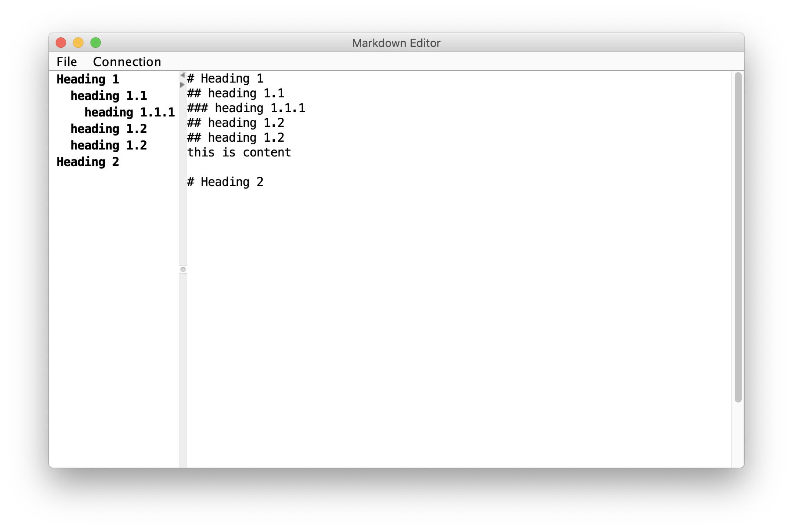
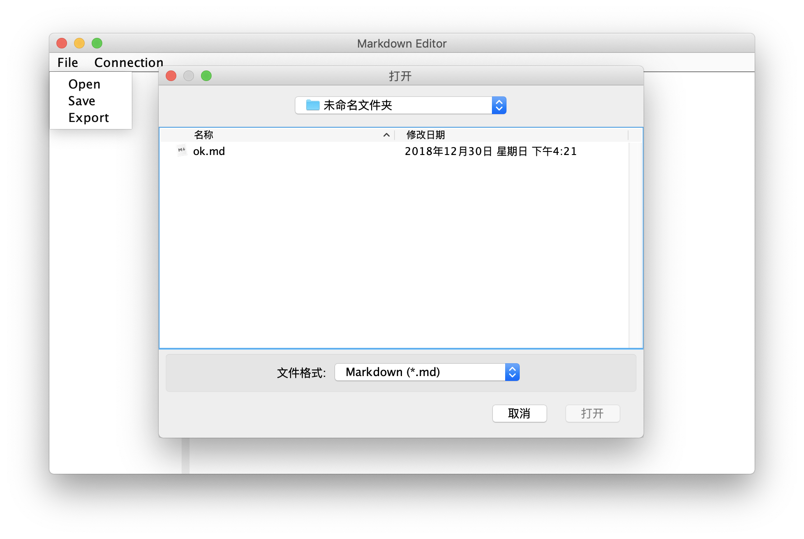
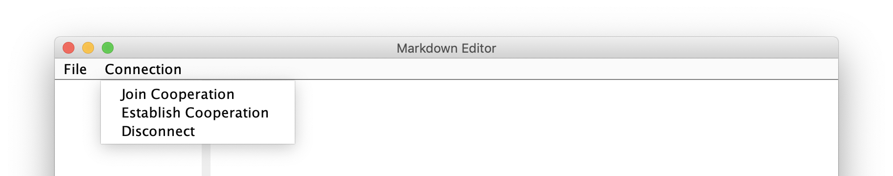
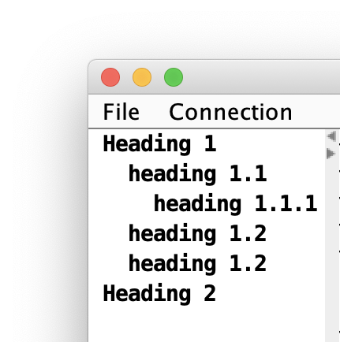

# Markdown-Editor

陈佳伟

3160102178

3160102178@zju.edu.cn

## 效果图

## 开发环境

macOS 10.14.2

JDK 1.8

## 第三方库

## 功能

### 打开/保存 markdown 文件

### 导出为 html 文件

### 与服务器连接，创建或加入一个协作编写组

### 侧边大纲视图

## 系统架构

## 具体实现

## 遇到的问题与解决

