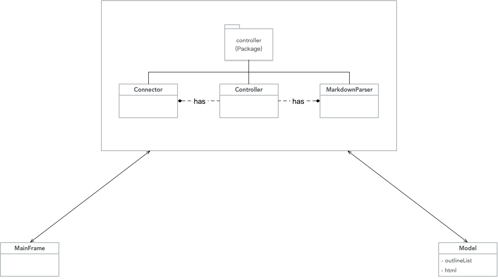
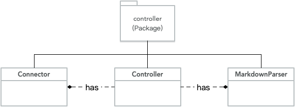
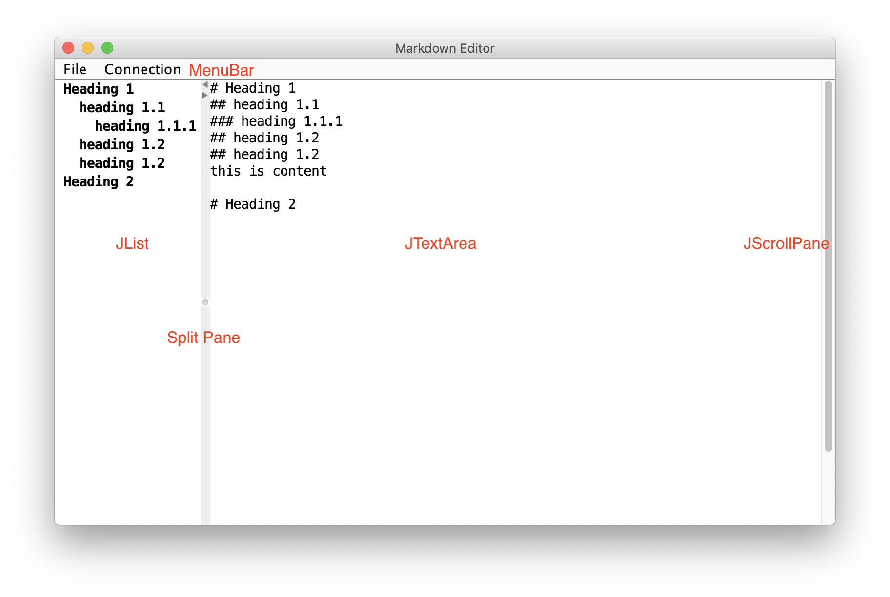
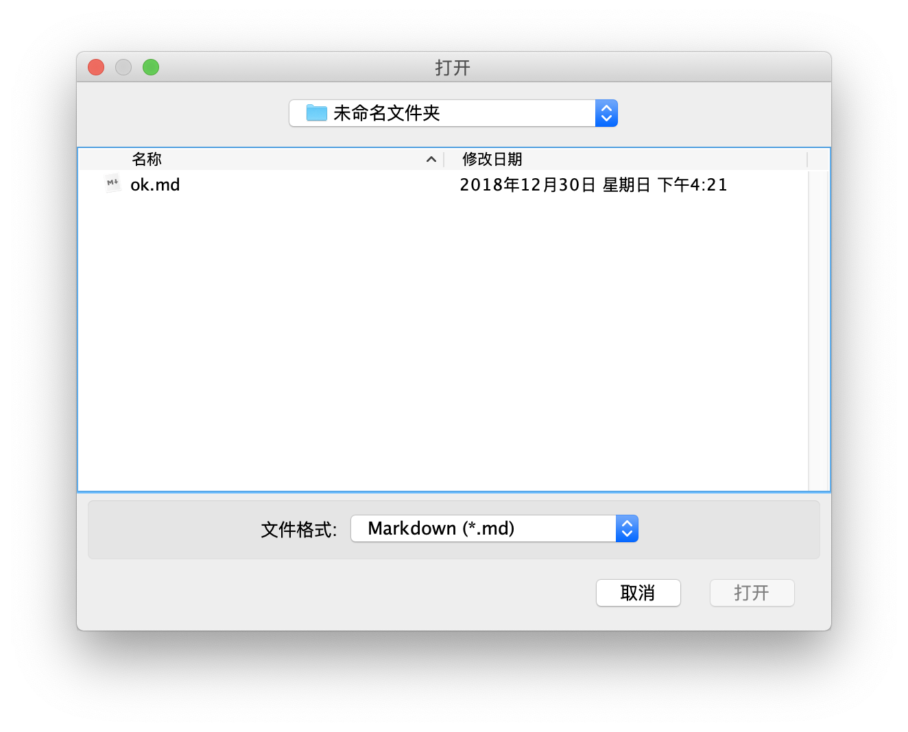
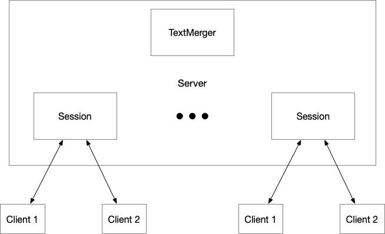

# Markdown-Editor

陈佳伟

3160102178

3160102178@zju.edu.cn

## 效果图


## 开发环境

macOS 10.14.2

JDK 1.8


## 第三方库

* diff-match-patch: https://github.com/google/diff-match-patch
* flexmark-java: https://github.com/vsch/flexmark-java

## 功能

### 打开/保存 markdown 文件


### 导出为 html 文件


### 与服务器连接，创建或加入一个协作编写组


### 侧边大纲视图


## 系统架构

### Client



`Client` 整个架构是 MVC 架构，中心的 `Controller` 负责协调 `View` 与 `Model` 进行消息传递。

#### controller package



`controller` 包内部分为 `Controller` 、`Connector` 、`MarkdownParser` 三部分。

其中 `Controller` 控制总的流程，而 `Connector` 则负责与 `Server` 通过 `Socket` 进行信息交互，包括接收和发送信息。`Connector` 负责解析 `markdown` 格式为 `html` 格式，这个类负责把外部库的 API 进行封装，将内部代码与第三方库解耦合，方便后续扩展。


#### Controller


#### Connector

`Connector` 使用了第二个线程来进行 `Socket` 监听，当读到来自 server 的消息时，根据消息类型进行发送给 `Controller` 处理。

建立 `Socket` 传输关系的主要方法如下：
```java
Socket socket = new Socket(ip, port);
ObjectOutputStream toServerStream = new ObjectOutputStream(socket.getOutputStream());
ObjectInputStream fromServerStream = new ObjectInputStream(socket.getInputStream());
```
接着就可以通过 `fromServerStream` 和 `toServerStream` 读写消息。


#### MarkdownParser

`MarkdownParser` 使用第三方库 `flexmark` 来用于将 `markdown`  解析为 `html` 格式。

将 `markdown` 格式解析出标题使用的是 JDK 1.8 的正则表达式功能。如解析第5级标题的正则表达式是：

```java
Pattern.compile("(?m)^#{5}(?!#)(.*)")
```


#### View



`View` 部分即为窗口组件，GUI 使用 Java Swing 来进行编程。

###### JMenuBar

顶栏使用了 `JMenuBar` ，其中包含了组件 `JMenu` 与 `JMenuItem` ，使用 `add()` 方法可以将其绑定。

例如：

```java
menuBar.add(menu);
menu.add(menuItem);
```


##### JList

左栏使用了 `JList` 来显示大纲，`Jlist` 绑定了 `DefaultListModel` ，将大纲信息存储在 `DefaultListModel` 中，一旦大纲信息改变，`Jlist` 会自动更新。使用缩进来表示大纲的层级。

```java
outlineList = new JList<>(listModel);
```


##### JTextArea

写作的窗口使用了 `JTextArea` ，使用 `DocumentListener` 来监听事件。

```java
editorArea.getDocument().addDocumentListener(documentListener)
private DocumentListener documentListener = new DocumentListener() {
        @Override
        public void insertUpdate(DocumentEvent e) {...}

        @Override
        public void removeUpdate(DocumentEvent e) {...}

        @Override
        public void changedUpdate(DocumentEvent e) {...}
};
```


##### JScrollPane

`JList` 和 `JTextArea` 都包了一层 `JScrollPane` 用于产生可以滚动的界面。

例如：

```java
JScrollPane editorPane = new JScrollPane(editorArea);
```


##### JFileChooser



文件选择器使用 `JFileChooser` 实现，可以使用 `FileNameExtensionFilter` 来添加类型过滤器。


#### Model

`Model` 中存储了用于更新侧边大纲的数据 `DefaultListModel<String>` 。

### Server



`Server` 维护了一个存储 `Session` 的 `HashMap` ，每个 `Session` 负责一组协作者。

```java
class Server {
    private static final int PORT = 12345;
    private SessionCollection sessionCollection = new SessionCollection();
    private ExecutorService threadPool = Executors.newCachedThreadPool();
    ...
}
```

每个 `Session` 也使用一个 `Map` 来存储 `Client` ，并且用一个 `String` 来存储公共的 markdown 文件。

```java
class Session {
    private Map<Integer, WriteSignal> writeSignalMap = Collections.synchronizedMap(new HashMap<>());
    private String text;
    ...
}
```

`Server` 端使用 Java 的线程池来创建线程与客户端进行信息传递。

```java
ExecutorService threadPool = Executors.newCachedThreadPool();
```

每个客户端都对应了 `read` 和 `write` 两个线程，分别用于读写数据。

当读线程读到一个传递文本的数据包时，读线程通知 `Session` 使用 

### Transmission Protocol

使用 `Packet` 来作为 `Server` 与 `Client` 之间的数据传递的数据结构。

```java
class Packet implements Serializable {
    private PacketType packetType;
    private String text;
	....
}
```

其中，`Packet` 中存储了 `packetType` 来指明数据包的类型：

```java
public static enum PacketType {
        //join a cooperation editing
        JOIN,
        //establish a cooperation editing
        ESTABLISH,
        //normal text packet
        TEXT,
        //close connection
        CLOSE,
        //reply message
        REPLY
}
```

将 `Packet` 实例序列化后即可通过 `Socket` 进行传输。


## 遇到的问题与解决

